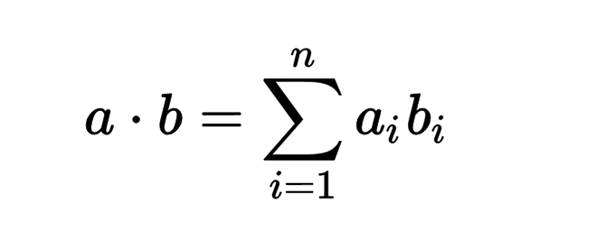
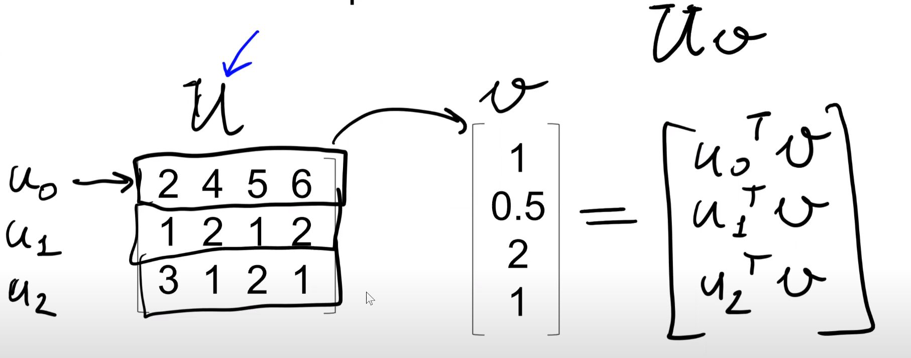
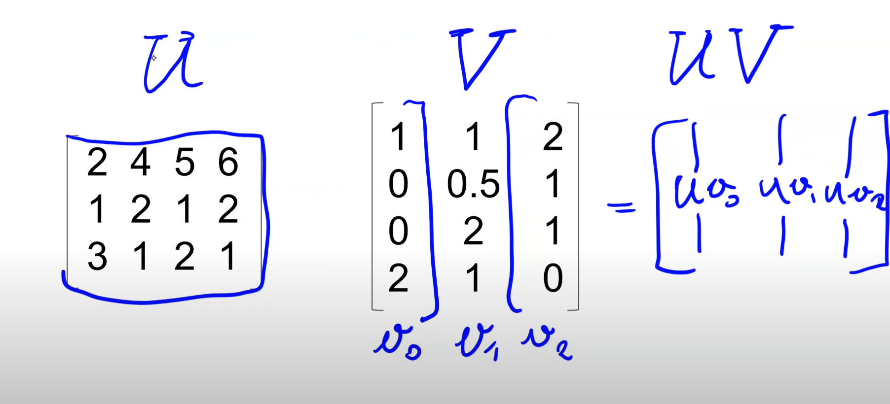

# Week One: Orientation and getting set up 🧭

## Rule based versus machine learning

- start with rule base, move to ML when rules become too complex/ too many
- rules are often good starting points for features


## Supervised learning

Teaching an algorithm by showing different examples in matrix `X` to get a prediction `y` by applying a function `g` where: `g(X) ≈ y`.
Based on the type of target we can have regression, classification (multiple classes or binary) or ranking.


## CRISP-DM

- methodology for organizing machine learning projects
### business case 
### -> data exploration  
    - is it reliable  
    - is there enough/ do we need to get more data  
    - will this data answer our questions  
### -> data preparation 
*(transform it so it can be used by an ML algorithm)*  
### -> modeling  
    - data is in a matrix format so we can train the model  
    - try different models to select the best one   
### -> evaluation  
    - how well did the model perform? *(metrics)*
    - have we reached the goal set by our business case?
    - we decide to go back and adjust the business goal
### -> deployment 
    - online evaluation with live users
    - often happens with the evaluation step
    - monitoring and reporting
    - iteration *(start simple -> learn from feedback -> improve -> repeat)*


## Model selection

- Logistic regression
- Decision tree
- Neural network
- Random forest
- and many more ...

- split data into training and evaluation (test) sets ie train_X, train_y, test_X, test_y
- train the models on the training data and compare their metrics when predicting on the test data
- problem with multiple comparison approach: one model can by chance get lucky and produce a good result
- to guard against this, we can use a validation set. In this case we test 20% for validation, 20% for testing and 60% for training. We now have three non-overlapping sets of data. We use the validation set to evaluate the model and the test set to check that the model did not only get lucky in this first evaluation


## Linear Algebra

### Vector operations: Multiplication

- normally in linear algebra vectors are represented as columns not rows
- transpose turns columns into rows (used to multiply vectors) so we have one row vector and one column vector

#### Vector-vector multiplication



```python
def vector_vector_multiplication(u, v):
    assert u.shape[0] == v.shape[0] # ensure vectors can be multiplied

    n = u.shape[0]
    sum_of_multiplication = 0.0

    for i in range(n): # in numpy the array is 0 indexed
        sum_of_multiplication += u[i] * v[i]
    
    return sum_of_multiplication
```

There is also the built in `u.dot(v)` or `sum(u_i * v_i)`

#### Matrix-vector multiplication

- the row vector must have as many columns as the column vector has rows
- Uppercase is used for a matrix and lowercase for vectors



```python
def matrix_vector_multiplication(U, v):
    assert U.shape[1] == v.shape[0]
    
    num_rows = U.shape[0]
    
    result = np.zeros(num_rows)
    
    for i in range(num_rows):
        result[i] = vector_vector_multiplication(U[i], v)
    
    return result
```

#### Matrix-matrix multiplication

- one matrix is split into columns and each column is multiplied with the other matrix



```python
def matrix_matrix_multiplication(U, V):
    assert U.shape[1] == V.shape[0]
    
    num_rows = U.shape[0]
    num_cols = V.shape[1]
    
    result = np.zeros((num_rows, num_cols))
    
    for i in range(num_cols):
        vi = V[:, i]
        Uvi = matrix_vector_multiplication(U, vi)
        result[:, i] = Uvi
    
    return result
```
**Note**: code samples are from [the following notebook](https://github.com/alexeygrigorev/mlbookcamp-code/blob/master/course-zoomcamp/01-intro/notebooks/08-linear-algebra.ipynb)


### Identity Matrix

- the diagonal elements are 1 and the rest are 0
- u multiplied with the identity matrix is the same as u
- the identity matrix multiplied with u is the same as u
- can be created with `np.eye(n)`


### Creating the inverse

```python
np.linalg.inv(A)
```

- if we multiply the inverse of A with A we get the identity matrix


## Homework

[Link to homework](../notebooks/homework_week_1.ipynb)